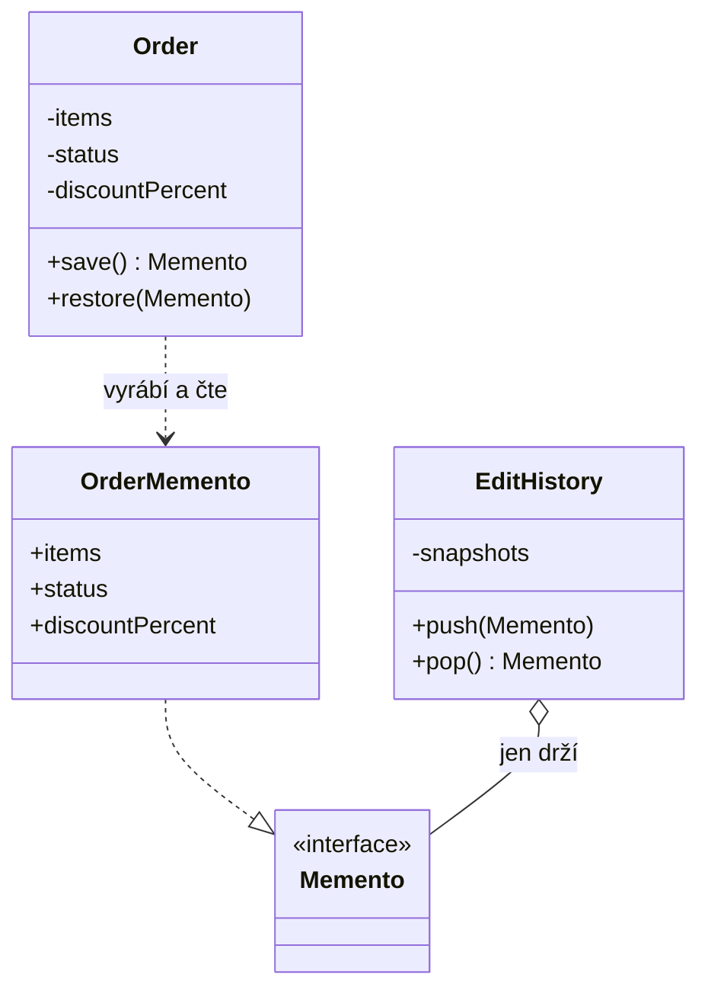

# Memento (Snímek)

> [← zpět na Behavioral patterny](../)

> **V jedné větě:** Objekt si sám vyrobí snímek svého stavu a sám se z něj umí obnovit — a ten, kdo snímek uchovává, se do něj nemůže podívat.

---

## Problém

Objednávka se dá v administraci upravovat a obchodník chce **krok zpět**. Nejrychlejší řešení vypadá takhle:

```php
// Zálohu si udělá ten, kdo edituje
$backup = [
    'items' => $order->items,
    'status' => $order->status,
    'discountPercent' => $order->discountPercent,
];

$order->applyDiscount(10);
$order->confirm();

// …a když si to rozmyslí, zapíše ji zpátky
$order->items = $backup['items'];
$order->status = $backup['status'];
$order->discountPercent = $backup['discountPercent'];
```

Aby to vůbec šlo napsat, musela `Order` **otevřít celý svůj vnitřek** — pole musí být veřejná nebo mít settery. Tím jsi ale rozdal klíče všem: cokoli teď může nastavit `status` na `confirmed`, aniž by prošlo `confirm()`.

**Poznáš to podle:**

- třída má settery, které existují **jen kvůli obnovení stavu**
- editor, formulář nebo historie zná pole entity jménem
- přidání nového pole znamená projít všechna místa, kde se dělá záloha — a na jedno se zapomene
- záloha je pole `array`, u kterého jen z PHPDoc poznáš, co v něm má být
- pravidla, která si třída hlídá v metodách, jdou obejít zápisem do pole ([Tell, Don't Ask](../../../Principles/ObjectDesign.md#tell-dont-ask))

Ta poslední odrážka je jádro věci. **Zapouzdření se tu neporušuje kvůli funkci, ale kvůli undo** — a to je vysoká cena za tlačítko „zpět".

---

## Řešení

Snímek si vyrábí i obnovuje **sám objekt**. Ven putuje jako neprůhledný balíček, který ten, kdo ho drží, neumí otevřít.



Podstatné je, **kdo na kterou šipku sahá**:

- `Order` jako jediná ví, co ve snímku je, a jako jediná ho umí přečíst.
- `EditHistory` pracuje s typem `Memento`, který **nemá jedinou metodu**. Nemůže se dovnitř podívat, i kdyby chtěla.
- Když v `Order` přibude pole, `EditHistory` se to vůbec nedotkne.

---

## Účastníci

| Účastník | Role | V ukázce |
| -------- | ---- | -------- |
| **Originator** | Objekt, jehož stav se snímkuje. Vyrábí snímek i se z něj obnovuje. | `Order` |
| **Memento** | Snímek stavu. Ven se ukazuje jako neprůhledný typ. | `OrderMemento` + rozhraní `Memento` |
| **Caretaker** | Drží snímky a rozhoduje **kdy** se obnoví. Neví, co v nich je. | `EditHistory` |

---

## Implementace v PHP

### Úzké rozhraní

```php
interface Memento
{
}
```

Prázdné rozhraní vypadá zvláštně, ale je to celý trik. **Pečovatel vidí jen tenhle typ**, takže se ke stavu nedostane.

```php
final readonly class OrderMemento implements Memento
{
    /** @param list<OrderItem> $items */
    public function __construct(
        public array $items,
        public string $status,
        public int $discountPercent,
    ) {
    }
}
```

> [!IMPORTANT]
> **V PHP tohle zapouzdření nedrží modifikátor přístupu, ale typ.** Jazyk nemá `friend` ani package-private, takže neexistuje způsob, jak pole zpřístupnit jen `Order` a nikomu jinému. Kdo si na snímek sáhne přes `OrderMemento` místo přes `Memento`, dovnitř se dostane. Rozdíl proti Javě nebo C++ je reálný a nemá cenu ho zastírat.

### Originátor

```php
final class Order
{
    /** @var list<OrderItem> */
    private array $items = [];

    private string $status = 'new';

    private int $discountPercent = 0;

    public function save(): Memento
    {
        return new OrderMemento(
            array_map(
                static fn (OrderItem $item): OrderItem => new OrderItem($item->sku, $item->quantity),
                $this->items,
            ),
            $this->status,
            $this->discountPercent,
        );
    }

    public function restore(Memento $memento): void
    {
        if (!$memento instanceof OrderMemento) {
            throw new InvalidArgumentException('Tenhle snímek nepatří objednávce.');
        }

        $this->items = $memento->items;
        $this->status = $memento->status;
        $this->discountPercent = $memento->discountPercent;
    }
}
```

Ten `array_map` uvnitř `save()` není ozdoba. **Je to rozdíl mezi funkčním a nefunkčním undo** — viz [Časté chyby](#časté-chyby).

### Pečovatel

```php
final class EditHistory
{
    /** @var list<Memento> */
    private array $snapshots = [];

    public function push(Memento $memento): void
    {
        $this->snapshots[] = $memento;
    }

    public function pop(): ?Memento
    {
        return array_pop($this->snapshots);
    }
}
```

Zásobník, který drží neprůhledné balíčky. **Nic víc a nic míň.**

### Varianta: neměnný objekt — a Memento zmizí

Když je objekt neměnný, snímek už existuje: **je to ta stará reference.**

```php
$before = $order;                    // to je celý „snímek"
$order = $order->withDiscount(10);
$order = $before;                    // a to je undo
```

| | Memento | Neměnný objekt |
| --- | --- | --- |
| Tříd navíc | 3 (`Memento`, `OrderMemento`, `EditHistory`) | 0 |
| Kde je stav | ve snímku | v předchozí instanci |
| Hluboká kopie | musíš ji napsat | netřeba, nic se nemění |
| Kdy to jde | vždycky | jen když objekt **může** být neměnný |

**Výchozí volba je neměnnost.** K Mementu sáhni, až když neměnný být nemůže — u entity s identitou, u rozdělaného formuláře, u editoru, kde na ten objekt drží referenci půlka aplikace.

### Co Mementem není

| Vypadá podobně | Proč to není Memento |
| -------------- | -------------------- |
| `clone $order` | Mělká kopie, která navíc obsahuje **všechno** včetně věcí, co do snímku nepatří (spojení, cache). `__clone()` to řeší jen zčásti. |
| `serialize($order)` | Sváže snímek s vnitřní strukturou třídy. Přejmenuješ pole a staré snímky přestanou jít načíst. |
| `json_encode($order)` | Ukládá jen veřejná pole — tedy přesně to, co u zapouzdřené entity není. |

---

## Kdy použít

- ✅ Objekt musí umět **krok zpět** a nemůže být neměnný.
- ✅ Rozdělaná práce se ukládá a později obnovuje (návrh objednávky, koncept, konfigurátor).
- ✅ Operace se zkusí nanečisto a při neúspěchu se stav vrátí.
- ✅ Undo potřebuje víc kroků zpátky, ne jen jeden.

## Kdy nepoužít

- ❌ **Objekt může být neměnný** — pak je snímek jen proměnná a Memento je tři třídy navíc.
- ❌ **Vrací se jedna hodnota, ne stav** — na to stačí lokální proměnná.
- ❌ **Stav je velký a snímků má být hodně** — paměť roste lineárně s historií; zvaž ukládání *rozdílů* nebo **Event Sourcing**.
- ❌ **Operace už opustila proces** — odeslaný e-mail ani stržená platba se obnovením objektu nevrátí. Memento vrací **stav v paměti**, ne následky.

> [!IMPORTANT]
> Ta poslední odrážka je nejčastější zdroj falešného bezpečí. **Undo nad Mementem není transakce.** Vrátí objekt, ne svět kolem něj.

---

## Časté chyby

| Chyba | Proč vadí | Jak správně |
| ----- | --------- | ----------- |
| **Mělká kopie měnitelných objektů** | Snímek sdílí objekty s originálem, takže se mění s ním — undo pak nevrátí nic | Hluboká kopie v `save()`, nebo měnitelné položky nahradit [value objecty](../../../DDD/ValueObject/) |
| Pečovatel má typ `OrderMemento` | Zapouzdření padá, protože si do snímku sáhne | Pečovatel pracuje **jen** s `Memento` |
| Snímek dostane settery „pro pohodlí" | Historie jde přepsat a undo přestane být spolehlivé | `readonly` |
| Historie roste bez omezení | Paměť roste s každou úpravou a nikdo si toho nevšimne | Omezit počet kroků zpět |
| Snímek se dělá po každé změně pole | Deset snímků na jednu úpravu formuláře | Snímkuj **před operací**, ne po každém zápisu |
| Undo se použije na věci mimo proces | Objekt se vrátí, e-mail zůstane odeslaný | Kompenzace, ne undo |
| Snímek se ukládá `serialize()` | Refaktoring třídy zneplatní staré snímky | Vlastní snímková třída s explicitními poli |

První řádek je ten, kvůli kterému má tenhle pattern vlastní demo:

```
mělký snímek: před změnou         2 kusy
po změně množství                 9 kusů
po undo                           9 kusů  ← undo nic nevrátilo
```

**Nejhorší na tom je, že s neměnnými položkami by takový test prošel.** Chyba se objeví až u prvního měnitelného pole ve snímku — tedy typicky až v produkci.

---

## V praxi

- **Doctrine ORM** drží u načtených entit *original entity data* — snímek stavu z okamžiku načtení. Při `flush()` ho porovná se současným stavem a z rozdílu sestaví `UPDATE`. Je to Memento použité k něčemu jinému než undo: ke **zjištění, co se změnilo**.
- **Databázová transakce** je Memento na úrovni databáze: `ROLLBACK` vrátí stav k `BEGIN`, aniž bys musel vědět, co mezitím proběhlo.
- **Textové editory a `git stash`** jsou tentýž nápad — odlož stav a později ho obnov.

---

## Související patterny

| Pattern | Vztah |
| ------- | ----- |
| [Command](../Command/) (GoF) | **Nejčastější dvojice.** Command říká, *co se má vrátit*, Memento *na co*. Undo se dělá buď odečtením operace, nebo obnovením snímku. |
| [Value Object](../../../DDD/ValueObject/) (DDD) | Když je stav složený z neměnných hodnot, hluboká kopie odpadá — snímek je bezpečný sám o sobě. |
| **Prototype** (GoF) | Sourozenec přes kopírování: Prototype kopíruje, **aby vznikl nový objekt**, Memento, **aby se dal vrátit ten původní**. |
| [State](../State/) (GoF) | Snímkovat lze i stavový objekt; Memento pak nese, ve kterém stavu se bylo. |
| [Iterator](../Iterator/) (GoF) | Historie snímků je kolekce — průchod bez vydání vnitřku platí i tady. |
| [Unit of Work](../../../PoEAA/UnitOfWork/) (PoEAA) | Sleduje změny od načtení; Doctrine k tomu používá právě snímek původních dat. |
| [First Class Collection](../../../ObjectCalisthenics/FirstClassCollection/) | Kam patří historie snímků, když k ní přibudou pravidla (limit kroků, mazání). |
| **Event Sourcing** | Opačný přístup: neukládá se stav, ale posloupnost změn. Historii dává zadarmo, ale je to jiná architektura, ne jiná třída. |

---

## Vztah k principům

| Princip | Jak souvisí |
| ------- | ----------- |
| [Tell, Don't Ask](../../../Principles/ObjectDesign.md#tell-dont-ask) | Místo „dej mi svá pole a já je uložím" se objektu řekne „ulož se" a „obnov se". |
| [SRP](../../../Principles/SOLID.md#single-responsibility-principle-srp) | Uchovávání historie je jiná odpovědnost než chování objednávky — proto pečovatel, ne pole v `Order`. |
| [Zákon Demeter](../../../Principles/ObjectDesign.md#zákon-demeter-law-of-demeter) | Pečovatel nesahá do vnitřku snímku ani objektu; drží neprůhledný typ. |
| [OCP](../../../Principles/SOLID.md#openclosed-principle-ocp) | Nové pole ve stavu se dotkne jen originátora a jeho snímku, ne pečovatele. |

---

## Demo

```bash
php SoftwareDesign/GoF/Behavioral/Memento/demo/run.php
```

Objednávka se dvěma kroky zpět, historie jako zásobník snímků. Demo ukáže, že pečovatel pracuje s rozhraním, které **nemá jedinou metodu**, a pak předvede past: tutéž objednávku se snímkem udělaným mělce.

Rozdíl je jediné `array_map` v `save()` — a bez něj undo nevrátí nic. Nakonec spočítá, kolik tříd Memento přidává (tři) a kolik jich je potřeba u neměnného objektu (žádná).

---

## Původ

|              |                            |
| ------------ | -------------------------- |
| **Zdroj**    | *Design Patterns* (GoF)    |
| **Autoři**   | Gamma, Helm, Johnson, Vlissides |
| **Rok**      | 1994                       |
| **Kategorie**| Behavioral                 |
| **Obtížnost**| ●●○○○                      |

GoF ho popisují záměrem *„zachytit a externalizovat vnitřní stav objektu tak, aby se do něj dal později vrátit — **aniž by se porušilo zapouzdření**"*. Ta druhá půlka věty je celý pattern; bez ní by stačilo pole veřejných getterů.

Kniha řeší zapouzdření tak, že memento má **dvě rozhraní**: široké pro originátora a úzké pro pečovatele. V C++ se to dělá přes `friend`, v Javě přes package-private. **PHP ani jedno nemá**, takže tu zbývá úzké rozhraní typem — a upřímné přiznání, že je to konvence, ne záruka.

Dvojka na obtížnosti není za tu třídu; ta je triviální. Je za dvě věci, které se dají udělat tiše špatně:

- **Mělká kopie**, která projde testem a selže až u měnitelného pole.
- **Záměna undo za rollback** — Memento vrátí objekt, ale ne to, co už odešlo ven.

---

## Zdroje

- Gamma, Helm, Johnson, Vlissides: *Design Patterns: Elements of Reusable Object-Oriented Software*, Addison-Wesley, 1994
- [Doctrine ORM: Working with Objects](https://www.doctrine-project.org/projects/doctrine-orm/en/current/reference/working-with-objects.html) — jak se sleduje, co se u entity změnilo

---

<details>
<summary>Metadata patternu</summary>

```yaml
name: Memento
name_cs: Snímek
category: Behavioral
source: GoF
authors: [Gamma, Helm, Johnson, Vlissides]
year: 1994
difficulty: 2
tags: [undo, snímek stavu, zapouzdření, historie, hluboká kopie]
principles: [Tell Don't Ask, SRP, Demeter, OCP]
related: [Command, ValueObject, State, UnitOfWork, FirstClassCollection]
status: done
```

</details>
