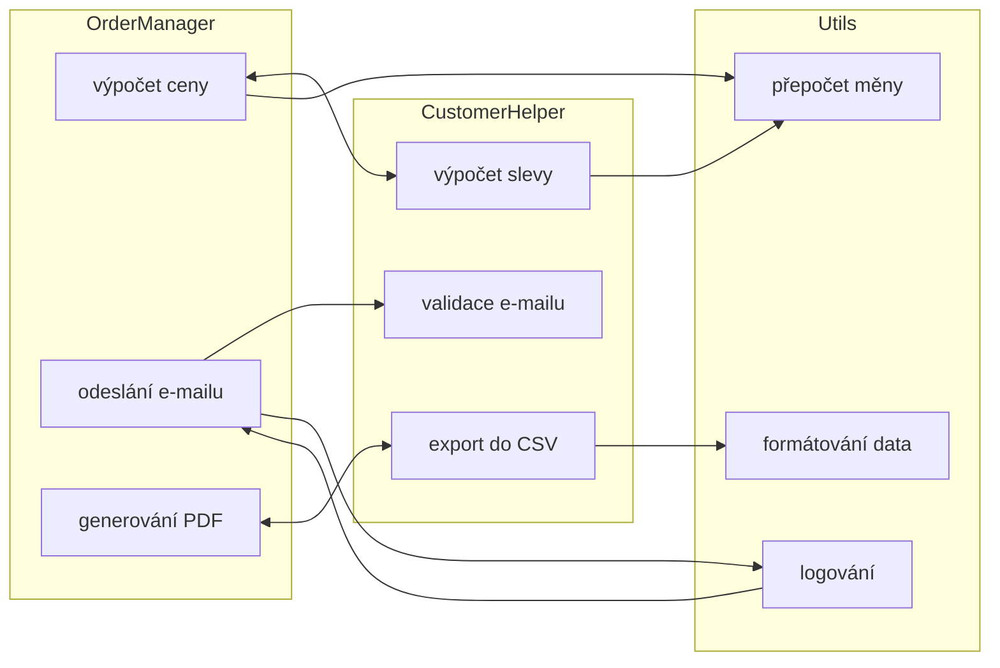
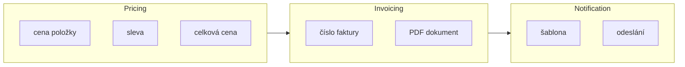
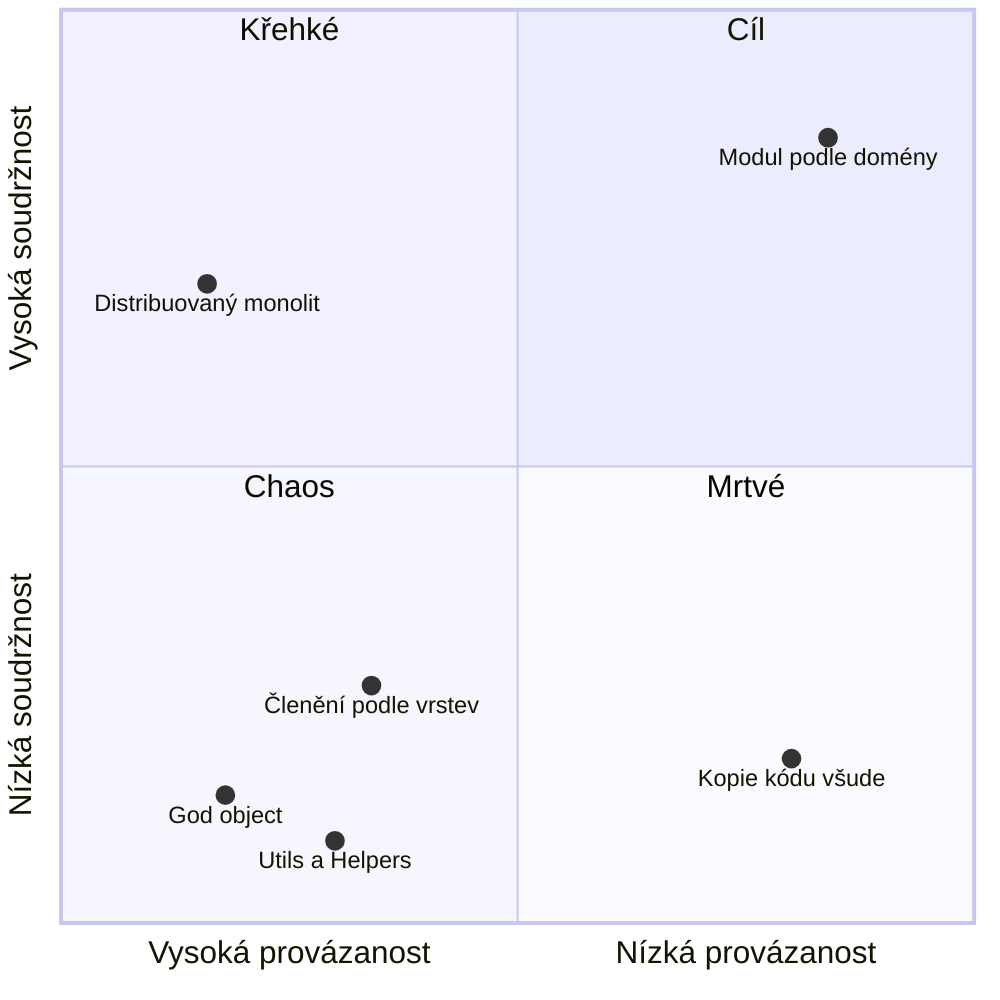

# Soudržnost a provázanost (High Cohesion, Low Coupling)

> [← zpět na Principy](README.md)

> **V jedné větě:** Co spolu souvisí, ať je pohromadě (**soudržnost**); co spolu nesouvisí, ať na sobě nezávisí (**provázanost**).

Tenhle princip je starší než všechno ostatní v téhle složce — **Larry Constantine a Ed Yourdon**, *Structured Design*, **1974**. Je to o dvacet let dřív než GoF a o třicet let dřív než SOLID, a není to náhoda: **[SOLID](SOLID.md) i většina patternů v tomhle katalogu jsou způsoby, jak toho dosáhnout.** Tohle je cíl, ony jsou taktika.

| | Co to měří | Chceš |
| --- | --- | --- |
| **Soudržnost** (cohesion) | Jak moc věci **uvnitř** jedné třídy/modulu patří k sobě | **vysokou** |
| **Provázanost** (coupling) | Jak moc na sobě jednotlivé třídy/moduly **závisejí** | **nízkou** |

---

## Jak to vypadá

### Jak ne



Dvě věci naráz, a obě špatně:

- **Nízká soudržnost** — v `OrderManager` je výpočet ceny vedle posílání e-mailů a generování PDF. Ty tři spolu nemají nic společného kromě toho, že se to všechno „týká objednávky“.
- **Vysoká provázanost** — každý modul sahá do každého, některé vazby jsou obousměrné. Změna v jednom místě se šíří nepředvídatelně.

### Jak ano



- **Vysoká soudržnost** — v `Pricing` je všechno o ceně a nic jiného. Kdo hledá slevu, ví kam jít.
- **Nízká provázanost** — tři vazby místo osmi, všechny jedním směrem. Změna ceníku se nedotkne šablon e-mailů.

### Čtyři možnosti, jen jedna dobrá



| Kvadrant | Co to je | Proč to nefunguje |
| -------- | -------- | ----------------- |
| **Chaos** — nízká soudržnost, vysoká provázanost | `God object`, `Utils` | Nikdo neví, co kde je, a změna se šíří všude |
| **Křehké** — vysoká soudržnost, vysoká provázanost | Pěkně pojmenované třídy, které na sobě všechny visí | Uvnitř to dává smysl, ale nejde nic změnit samostatně |
| **Mrtvé** — nízká soudržnost, nízká provázanost | Nesouvisející kód poházený bez vazeb | Nespadne to, ale nikdo nepozná, co k čemu patří |
| **Cíl** — vysoká soudržnost, nízká provázanost | Modul podle domény | Změna má jedno místo a nešíří se |

Dva body z grafu stojí za komentář, protože je lidé umísťují špatně:

- **Členění podle vrstev** (`Entity/`, `Repository/`, `Service/`, `Controller/`) vypadá uspořádaně, ale je to **chaos**: jedna změna funkce se dotkne všech čtyř složek. Co se mění spolu, je rozházené. Členění **podle domény** dá totéž do jedné složky.
- **Distribuovaný monolit** má uvnitř služeb slušnou soudržnost, ale služby na sobě visí synchronními voláními. Uvnitř to dává smysl, vydat nic samostatně nejde — proto **křehké**, ne cíl.

Pozor na past: **provázanost sama o sobě se dá snížit triviálně** — dej všechno do jedné třídy a vazby zmizí. Vznikne ale god object. **Soudržnost se taky dá zvýšit triviálně** — jedna třída na každou metodu. Vznikne bludiště. Cíl je obojí naráz, a proto se ty dvě veličiny hodnotí spolu.

---

## Stupnice provázanosti

Constantine je seřadil od nejhorší po nejlepší. Není to akademické — dá se podle toho v code review ukázat prstem.

| Stupeň | Co to je | V PHP vypadá jako |
| ------ | -------- | ----------------- |
| ❌ **Obsahová** | Modul sahá do vnitřku jiného | Sahání na `private` přes reflexi, `$order->items[0]->price = 0` |
| ❌ **Společná** | Sdílený globální stav | `global`, statické proměnné, [singleton s daty](../GoF/Creational/Singleton/), `$_SESSION` napříč |
| ❌ **Řídicí** | Předáváš příznak, který řídí chování druhého | `save($order, isDraft: true)` — volající rozhoduje o vnitřku |
| ⚠️ **Otisková** | Předáváš celý objekt, když potřebuješ jednu hodnotu | `calculate(Order $order)`, když stačí `int $totalInCents` |
| ✅ **Datová** | Předáváš přesně to, co je potřeba | `calculate(int $totalInCents, int $percent)` |

A dvě, které Constantine ještě neznal, protože neexistovaly:

| Stupeň | Co to je | Kde |
| ------ | -------- | --- |
| ❌ **[Časová](../Glossary.md#časová-vazba-temporal-coupling)** | Aby fungovalo A, musí zrovna teď běžet B | Synchronní volání cizí služby — [Service Composition](../Architecture/ServiceComposition/#cena-za-synchronní-volání) |
| ⚠️ **Na tvaru dat** | Dva moduly sdílejí formát, který ani jeden nevlastní | Sdílená DB tabulka, sdílený model mezi kontexty |

### Řídicí provázanost, protože ta je nejzákeřnější

Vypadá nevinně a v kódu je jí plno:

```php
// Řídicí provázanost: volající rozhoduje, co se uvnitř stane
public function save(Order $order, bool $sendEmail = true, bool $isDraft = false): void
{
    if ($isDraft === false) {
        $this->validate($order);
    }

    $this->repository->save($order);

    if ($sendEmail) {
        $this->mailer->send($order);
    }
}

// Volání, ze kterého nepoznáš vůbec nic
$service->save($order, false, true);
```

Ty dva `bool` znamenají, že **volající musí vědět, jak metoda uvnitř funguje**. A při každém dalším příznaku se počet cest kódem zdvojnásobí.

```php
// Datová provázanost: každá operace má jméno a dělá jednu věc
public function saveDraft(Order $order): void { /* … */ }

public function publish(Order $order): void { /* … */ }
```

Pravidlo palce: **`bool` parametr, který mění chování metody, je skoro vždycky signál, že tam patří dvě metody.**

---

## Stupnice soudržnosti

Taky od nejhorší po nejlepší:

| Stupeň | Co drží věci pohromadě | Typický název třídy |
| ------ | ---------------------- | ------------------- |
| ❌ **Náhodná** | Nic. Prostě se to nikam nevešlo | `Utils`, `Helpers`, `Common`, `Tools` |
| ❌ **Logická** | Patří do stejné kategorie | `Validators` se všemi validacemi v aplikaci |
| ❌ **Časová** | Spouští se ve stejnou chvíli | `Bootstrap`, `AfterOrderCreated` s pěti nesouvisejícími kroky |
| ⚠️ **Procedurální** | Následuje to po sobě | `OrderProcessor` s krokovým `process()` |
| ⚠️ **Komunikační** | Pracuje to nad stejnými daty | `OrderManager` — všechno, co se týká objednávky |
| ✅ **Funkční** | Všechno přispívá k **jedné úloze** | `ShippingCostCalculator`, `InvoiceNumberGenerator` |

Nejrychlejší test soudržnosti je **jméno**:

- Jde třída pojmenovat **jedním konkrétním úkolem**? → funkční soudržnost
- Musí být v názvu `Manager`, `Helper`, `Utils`, `Service`, nebo spojka „a“? → něco tam nepatří

To je stejná úvaha jako [pojmenování doménové služby](../DDD/DomainService/#jméno-rozhoduje) — a není náhoda, že vede ke stejnému závěru.

---

## Jak to poznáš na svém kódu

Bez metrik, jen z toho, co se ti děje při práci:

| Signál | Co to znamená |
| ------ | ------------- |
| Jedna změna si vynutí úpravu v pěti souborech | **Vysoká provázanost** |
| Musíš namockovat osm věcí, abys otestoval jednu | **Vysoká provázanost** |
| Nováček se ptá, kde je logika pro X, a odpověď je „to je na třech místech“ | **Nízká soudržnost** |
| Třída má 800 řádků a v konstruktoru osm závislostí | Obojí naráz |
| Bojíš se sáhnout do souboru, protože nevíš, co to rozbije | Obojí naráz |
| Dva soubory se v gitu mění vždycky spolu | Patří k sobě — **nízká soudržnost**, jsou rozdělené špatně |

Ten poslední se dá i změřit: **historie gitu ukáže, co se mění spolu.** Když se dva soubory v 90 % commitů objevují společně, nejsou to dva moduly, ale jeden rozdělený na dva.

---

## Kde se to v katalogu potkává

Skoro všude — a to je pointa. Tenhle princip je **cíl**, patterny jsou cesty:

| Pattern / princip | Co s tím dělá |
| ----------------- | ------------- |
| [SRP](SOLID.md#single-responsibility-principle-srp) | Přímý předpis na vysokou soudržnost: jeden důvod ke změně |
| [DIP](SOLID.md#dependency-inversion-principle-dip) | Snižuje provázanost tím, že závislost míří na abstrakci |
| [ISP](SOLID.md#interface-segregation-principle-isp) | Snižuje provázanost: nezávisíš na tom, co nepoužíváš |
| [Zákon Demeter](ObjectDesign.md#zákon-demeter-law-of-demeter) | Brání obsahové provázanosti — nesaháš skrz cizí strukturu |
| [Tell, Don't Ask](ObjectDesign.md#tell-dont-ask) | Zvyšuje soudržnost: chování zůstane u dat |
| [Ports & Adapters](../Architecture/PortsAndAdapters/) | Nízká provázanost mezi doménou a okolím |
| [Bounded Context](../DDD/BoundedContext/) | **Totéž v měřítku celé firmy**: vysoká soudržnost uvnitř kontextu, nízká provázanost mezi nimi |
| [Aggregate](../DDD/Aggregate/) | Hranice, uvnitř které je soudržnost nutná |
| [Domain Event](../DDD/DomainEvent/) | Rozvazuje: producent nezná konzumenty |
| [Data Mapper](../PoEAA/DataMapper/) | Rozvazuje doménu a databázové schéma — demo měří, že nemají společný ani sloupec |
| [Strategy](../GoF/Behavioral/Strategy/) | Nahrazuje řídicí provázanost (`bool` příznak) polymorfismem |
| [Decorator](../GoF/Structural/Decorator/) | Totéž jinak: příznaky v konstruktoru nahradí skládání obalů |

---

## Provázanost mezi týmy

Stupnice výš platí na funkce, třídy i moduly — a **stejně tak na týmy**. To není analogie: provázanost mezi lidmi se do kódu propíše, protože kód píšou oni.

Popisuje to [Conwayův zákon](ConwaysLaw.md): *organizace jsou nuceny produkovat návrhy, které kopírují jejich komunikační strukturu*. Prakticky to znamená, že **hranice, kterou v kódu nakreslíš proti organizaci, se dřív nebo později rozpustí** — a naopak že organizační šev se v kódu objeví, i když jsi ho tam nechtěl.

Když ti tedy nízká provázanost mezi moduly nevychází, stojí za to se podívat, jestli problém není o patro výš.

---

## Kdy nízká provázanost není cíl

Aby to nebylo dogma: **rozvazování něco stojí** a dá se ho udělat příliš.

- **Abstrakce s jedinou implementací** sníží provázanost na papíře a zvýší počet souborů v realitě. To je [YAGNI](Simplicity.md#yagni--you-arent-gonna-need-it).
- **Události místo volání** rozvážou moduly, ale z kódu přestane být vidět tok. Pak se ptáš „kdo tohle vlastně zavolá?“ a odpověď není nikde.
- **Uvnitř jednoho modulu je těsná vazba v pořádku** — dokonce žádoucí. Nízkou provázanost chceš **mezi** moduly, ne uvnitř nich. Kdyby uvnitř nebyla vazba, není to modul.

Kontrolní otázka: **rozvazuju něco, co se opravdu bude měnit nezávisle?** Když ne, kupuješ si flexibilitu, kterou nikdy nevyužiješ.

---

## Původ

| | |
| --- | --- |
| **Autoři** | Larry Constantine, Ed Yourdon |
| **Rok** | **1974** (článek), 1979 (*Structured Design*) |

Constantine ty pojmy zavedl v době **strukturovaného programování** — objekty ještě neexistovaly, mluvilo se o modulech a podprogramech. To je zároveň důvod, proč jsou tak trvanlivé: **nejsou vázané na žádný programovací styl.** Platí na funkce, na třídy, na balíčky, na služby i na týmy.

Vztah k novějším principům je hierarchický a stojí za to ho vidět: **soudržnost a provázanost jsou cíl, [SOLID](SOLID.md) jsou taktiky, patterny jsou konkrétní řešení.** Když si nejsi jistý, jestli má nějaké pravidlo v konkrétní situaci smysl, ptej se na tuhle úroveň — protože ta se nemění.

---

## Zdroje

- W. Stevens, G. Myers, L. Constantine: *Structured Design*, IBM Systems Journal, 1974
- Larry Constantine, Ed Yourdon: *Structured Design*, Prentice Hall, 1979
- Robert C. Martin: *Clean Architecture*, Prentice Hall, 2017 — část o komponentách
