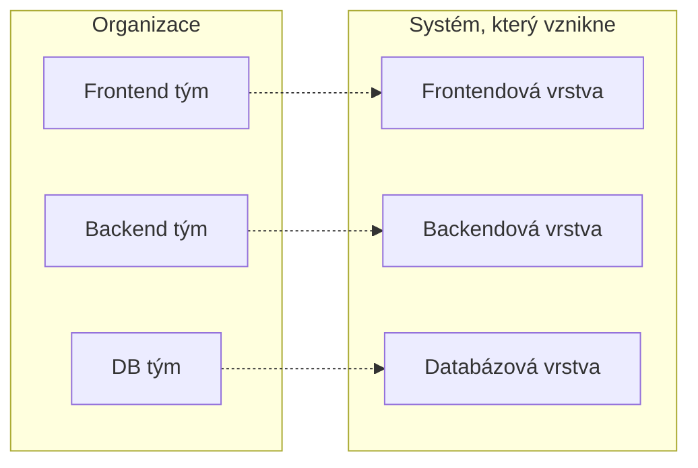
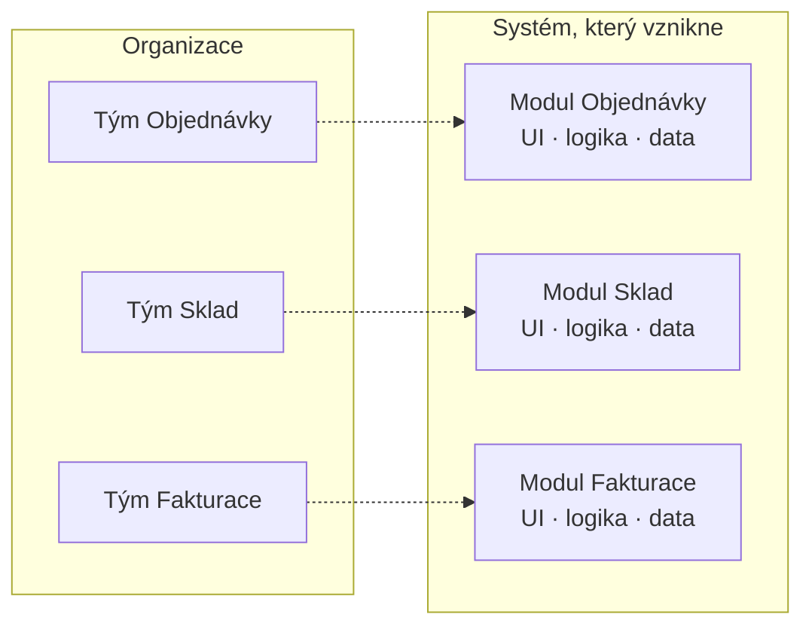

# Conwayův zákon

> [← zpět na Principy](README.md)

> **Organizace, které navrhují systémy, jsou nuceny produkovat návrhy, které kopírují komunikační strukturu těchto organizací.**
> — Melvin E. Conway, 1968

Není to rada ani doporučení. Je to **pozorování o tom, co se stane, ať chceš nebo ne** — a jediné, co s ním jde dělat, je počítat s ním.

Přesné Conwayovo znění:

> „organizations which design systems (in the broad sense used here) **are constrained to produce designs which are copies of the communication structures** of these organizations"

Slovo *constrained* je klíčové: nejde o tendenci, ale o omezení.

---

## Jak to vypadá

### Tři týmy podle vrstev

Firma má tým na frontend, tým na backend a tým na databázi. Každý dělá svou vrstvu dobře.

Výsledek: **vrstvená architektura**. Ne proto, že by ji někdo navrhl, ale protože přidat funkci znamená domluvit se přes tři týmy — a to je nejdražší operace v systému. Každý tým proto řeší co nejvíc u sebe.

Poznávací znak: **funkce, která by měla trvat dva dny, trvá tři týdny** a většina toho času je čekání.

### Tři týmy podle domén

Táž firma, stejný počet lidí, jiné rozdělení. Každý tým vlastní jednu doménu od databáze po obrazovku.

Výsledek: **modulární architektura** s hranicemi kolem domén — a je to skoro totéž rozdělení, jaké by dal [Bounded Context](../DDD/BoundedContext/). Ne náhodou.

**Stejní lidé, stejná technologie, jiná architektura.** Rozdíl je jen v tom, kdo s kým musí mluvit.

---

## Proč to platí

Mechanismus je nudnější, než se čeká, a právě proto tak spolehlivý. Conwayova úvaha: aby dvě části systému spolu fungovaly, **musí se jejich autoři domluvit**. Kde se lidé domluví snadno, tam vznikne těsná vazba. Kde se domlouvají obtížně, tam vznikne rozhraní — nebo se tomu propojení radši vyhnou úplně.

| Komunikace mezi lidmi | Co z toho vznikne v kódu |
| --------------------- | ------------------------ |
| Sedí spolu, mluví denně | Těsná vazba, sdílené třídy, společná databáze |
| Jiný tým, občasná schůzka | Rozhraní, API, verzování |
| Jiná firma, smlouva | Ostrá hranice, [překladová vrstva](../DDD/AnticorruptionLayer/) |
| Nemluví spolu vůbec | Duplicita — každý si to napíše znovu |

Poslední řádek je nejzajímavější. **Duplicita napříč systémem není lenost, je to příznak.** Když dva týmy napíšou totéž dvakrát, obvykle to není proto, že by o sobě nevěděly, ale proto, že se dohodnout bylo dražší než napsat to znovu.

---

## Co na to výzkum

Conwayův zákon zní jako aforismus, ale **byl empiricky otestován**.

MacCormack, Baldwin a Rusnak (Harvard Business School) publikovali v roce 2012 v *Research Policy* studii *Exploring the Duality Between Product and Organizational Architectures: A Test of the „Mirroring" Hypothesis*. Využili přirozený experiment: **porovnali produkty, které dělají totéž, ale vznikly v různě uspořádaných organizacích** — typicky komerční software vyvíjený soustředěným týmem proti open source projektu s rozptýlenými přispěvateli.

Architektury porovnávali pomocí *Design Structure Matrices*, které umožňují změřit míru modularity. Závěr podpořil takzvanou **hypotézu zrcadlení**: produkty mají sklon zrcadlit architekturu organizace, ve které vznikly, protože její řídicí struktury, způsoby řešení problémů a komunikační vzorce **omezují prostor, ve kterém organizace hledá řešení**.

Pro čtení dokumentu z toho plyne jedno: **tohle není folklor.** Když se architektura a organizace rozcházejí, jedna z nich se přizpůsobí — a obvykle to je architektura.

---

## Obrácený Conwayův manévr

Když zákon platí, dá se použít **jako nástroj**. Postup se jmenuje *inverse Conway manoeuvre* a pochází z ThoughtWorks:

> Nenavrhuj architekturu a nedoufej, že ji organizace unese. **Uspořádej týmy tak, jak má vypadat architektura**, a nech zákon pracovat pro sebe.

| Chceš | Uspořádej týmy tak, že |
| ----- | ---------------------- |
| Modulární monolit s doménovými hranicemi | každý tým vlastní jednu doménu celou, od dat po UI |
| Mikroslužby | tým zvládne službu nasadit sám, bez čekání na jiný |
| Sdílené jádro | jeden tým ho vlastní a ostatní jsou jeho zákazníci |
| Vrstvenou architekturu | rozděl týmy podle vrstev — a počítej s tím, co to udělá |

Nejrozsáhlejší zpracování téhle myšlenky je kniha **Team Topologies** (Matthew Skelton, Manuel Pais, 2019), která z ní dělá katalog typů týmů a způsobů, jak spolu mají komunikovat.

> [!WARNING]
> **Manévr má háček, který se přehlíží.** Reorganizace týmů je z nejdražších a nejbolestivějších zásahů, jaké firma může udělat — týká se lidí, ne kódu. Použít Conwayův zákon jako záminku k přeskládání týmů „kvůli architektuře" je snadné a často se to nevyplatí. **Zákon je hlavně diagnostický nástroj**; jako páka funguje jen tehdy, když se organizace stejně mění z jiných důvodů.

---

## Jak to poznáš u sebe

Čtyři otázky, které odhalí, že architektura kopíruje organizaci — a ne naopak:

| Otázka | Když ano |
| ------ | -------- |
| Odpovídá rozdělení repozitářů či modulů rozdělení týmů? | Zákon je vidět v čisté podobě |
| Trvá běžná funkce déle proto, že se čeká na jiný tým? | Hranice vede špatně — přes tok práce |
| Existuje v systému duplicita mezi částmi, které vlastní různé týmy? | Domluvit se bylo dražší než napsat to znovu |
| Je nejsložitější rozhraní v systému mezi týmy, které si nesedí? | Komunikační potíž se propsala do kódu |

Poslední řádek stojí za rozvedení. **Nejošklivější místa v kódu bývají tam, kde je organizační šev**, ne tam, kde je technicky složitý problém. Tomu se dá udělat jednoduchý test: podívej se na části systému, které nikdo nechce měnit, a zjisti, kolik týmů je musí odsouhlasit.

---

## Kde se to v katalogu potkává

| Souvislost | Jak |
| ---------- | --- |
| [Soudržnost a provázanost](CohesionAndCoupling.md) | **Tentýž princip o patro výš.** Provázanost mezi týmy se propíše do provázanosti mezi moduly; Conwayův zákon je vysvětlení, proč. |
| [Bounded Context](../DDD/BoundedContext/) | Hranice kontextu a hranice týmu **mají splývat**. Když nesplývají, jednu z nich to rozloží — a bývá to ta v kódu. |
| [Context Map](../DDD/ContextMap/) | Mapa vztahů mezi kontexty je do velké míry mapou vztahů mezi týmy; vzory jako *Customer/Supplier* nebo *Conformist* popisují lidi, ne kód. |
| [Anticorruption Layer](../DDD/AnticorruptionLayer/) | Vzniká typicky tam, kde je organizační hranice — jiný tým, jiná firma, jiný dodavatel. |
| [Segregated Core](../DDD/SegregatedCore/) | Oddělit jádro se daří tehdy, když ho někdo vlastní. Bez vlastníka se hranice rozpustí. |
| [Core Domain](../DDD/CoreDomain/) | Evansovo „apply top talent to the core" je organizační rozhodnutí s architektonickým důsledkem — Conwayův zákon v praxi. |
| [Ubiquitous Language](../DDD/UbiquitousLanguage/) | Jazyk se láme přesně na organizačních hranicích; proto platí uvnitř kontextu, ne napříč firmou. |
| [Code review](../../Processes/CodeReview/) | Kdo koho recenzuje, je komunikační struktura — a ta podle zákona formuje kód. |
| [Trunk-Based Development](../../GitWorkflows/TrunkBasedDevelopment/) | Předpokládá tým, který se domluví rychle. Model větvení je taky komunikační struktura. |

---

## Kdy to není páka

Zákon platí, ale **jako argument se dá zneužít.** Tři situace, kde se na něj odkazuje neprávem:

- **„Máme špatnou architekturu, protože máme špatné týmy."** Někdy je architektura špatná prostě proto, že ji nikdo nepromyslel. Conwayův zákon není omluvenka.
- **„Přeskládáme týmy a architektura se spraví sama."** Nespraví. Zákon říká, že nová struktura bude formovat *budoucí* návrh — starý kód se nepřepíše sám a reorganizace ho nechá tam, kde je.
- **„Musíme mít tým na každou službu."** Zákon nic neříká o tom, kolik týmů má být. Říká jen, že jejich komunikační struktura se objeví v systému.

Praktické shrnutí: **je to zákon zachování, ne návod.** Pomáhá vysvětlit, proč věci vypadají, jak vypadají, a varovat před rozhodnutími, která proti němu jdou. Nenahrazuje návrh.

---

## Původ

|             |                    |
| ----------- | ------------------ |
| **Autor**   | Melvin E. Conway   |
| **Rok**     | 1968               |
| **Zdroj**   | *How Do Committees Invent?*, Datamation |

Conway článek nabídl nejdřív *Harvard Business Review*, který ho v roce **1967 odmítl** s tím, že tvrzení není doložené. Vyšel tedy v dubnu **1968** v časopise *Datamation*.

Jméno „Conwayův zákon" mu dal až **Fred Brooks**, který ho citoval v *The Mythical Man-Month* (1975) — a odtud se rozšířilo. Sám Conway o tom mluví jako o pozorování, ne o zákonu.

Za povšimnutí stojí ironie kolem odmítnutí: **výhrada recenzenta zněla, že tvrzení není podložené** — a trvalo víc než čtyřicet let, než se to změnilo. Studie MacCormacka, Baldwina a Rusnaka z roku 2012 je první rozsáhlý empirický test a dopadla ve prospěch Conwaye.

Zákon zestárl pozoruhodně dobře. Vznikl v době sálových počítačů a týmů, které si posílaly děrné štítky; platí ve světě mikroslužeb a rozptýlených týmů stejně, protože **nemluví o technologii, ale o lidech**.

---

## Zdroje

- Melvin E. Conway: [*How Do Committees Invent?*](https://melconway.com/Home/pdf/committees.pdf) (PDF), Datamation, duben 1968 — původní článek
- [melconway.com: Conway's Law](https://www.melconway.com/Home/Conways_Law.html) — autorova vlastní stránka
- MacCormack, A., Baldwin, C., Rusnak, J.: [*Exploring the Duality Between Product and Organizational Architectures: A Test of the „Mirroring" Hypothesis*](https://www.hbs.edu/faculty/Pages/item.aspx?num=32217), Research Policy, 2012
- Martin Fowler: [*Conway's Law*](https://martinfowler.com/bliki/ConwaysLaw.html)
- Matthew Skelton, Manuel Pais: *Team Topologies*, IT Revolution Press, 2019
