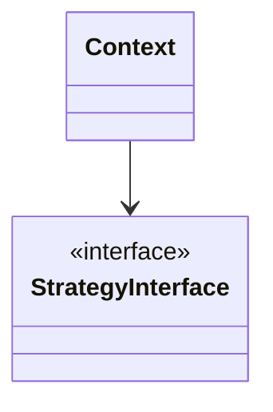

<!--
ŠABLONA PRO POPIS PATTERNU
Vyplň všechny sekce, nepoužité smaž (kromě povinných: Původ, Problém, Řešení,
Implementace, Kdy použít, Časté chyby, Související patterny).
Obsah česky, kód a názvy tříd anglicky. Tyhle HTML komentáře po vyplnění smaž.
-->

# PatternName (Český název)

> **V jedné větě:** <!-- Co pattern dělá. Max 25 slov, srozumitelné pro juniora. -->

---

## Původ

|              |                                                   |
| ------------ | ------------------------------------------------- |
| **Zdroj**    | Design Patterns: Elements of Reusable OO Software  |
| **Autoři**   | Gamma, Helm, Johnson, Vlissides („Gang of Four“)   |
| **Rok**      | 1994                                              |
| **Kategorie**| Behavioral                                        |
| **Obtížnost**| ●●○○○                                             |

<!-- 2–4 věty: v jaké knize/článku pattern vznikl, jaký problém tehdy řešil,
     proč je dodnes relevantní. Kontext, ne převyprávěná definice. -->

---

## Problém

<!-- Popiš situaci v kódu, ne abstraktní definici. Ideálně krátká ukázka
     „špatného“ kódu, ze které je problém vidět na první pohled. -->

**Poznáš to podle:**

- <!-- konkrétní symptom v kódu -->
- <!-- konkrétní symptom v kódu -->

```php
// Před: co je na tomhle kódu špatně
```

---

## Řešení

<!-- Jak pattern problém řeší. Nejdřív princip jednou větou, pak rozvedení. -->



---

## Účastníci

| Role     | Odpovědnost                    |
| -------- | ------------------------------ |
| `Name`   | <!-- co dělá --> |

---

## Implementace v PHP

<!-- Minimální, ale spustitelný kód. Bez frameworků. PHP 8.3+,
     declare(strict_types=1), komentáře česky, identifikátory anglicky. -->

```php
<?php
declare(strict_types=1);
```

### Použití

```php
```

---

## Kdy použít

- ✅ <!-- konkrétní situace -->

## Kdy nepoužít

- ❌ <!-- konkrétní situace + co použít místo toho -->

---

## Časté chyby

<!-- To, na čem se juniorům (a nejen jim) reálně láme vaz. -->

| Chyba | Proč vadí | Jak správně |
| ----- | --------- | ----------- |
|       |           |             |

---

## V praxi

<!-- Kde tenhle pattern potkáš v reálných knihovnách a v našich projektech.
     Konkrétní třídy/rozhraní, ne obecné fráze. -->

- **Symfony / Doctrine / PSR:** <!-- konkrétní příklad -->
- **U nás:** <!-- konkrétní příklad z našich služeb, pokud existuje -->

---

## Související patterny

| Pattern | Vztah |
| ------- | ----- |
| [OtherPattern](../OtherPattern/) | <!-- v čem se liší / kdy sáhnout po něm --> |

---

## Demo

<!-- Jen pokud existuje složka demo/. Jinak celou sekci smaž. -->

```bash
php GoF/Behavioral/PatternName/demo/run.php
```

---

## Zdroje

- <!-- kniha, kapitola, strana / odkaz -->

---

<details>
<summary>Metadata patternu</summary>

<!-- Strojově čitelná hlavička. Drž klíče i jejich pořadí, do budoucna z nich
     půjde generovat přehledové tabulky. Patří na konec souboru, aby
     nezaclánělo obsahu. -->

```yaml
name: PatternName
name_cs: Český název
category: Creational | Structural | Behavioral | —
source: GoF – Design Patterns
authors: Gamma, Helm, Johnson, Vlissides
year: 1994
difficulty: 2
tags: [tag1, tag2]
related: [OtherPattern, AnotherPattern]
status: draft | done
```

</details>
